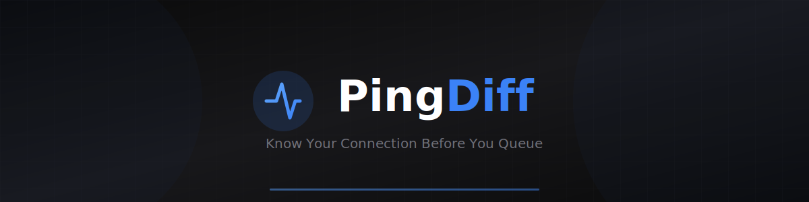

<div align="center">



<br/>
<br/>

[](https://github.com/bokiko/pingdiff/releases/latest)
[](LICENSE)
[](https://pingdiff.com)
[](https://github.com/bokiko/pingdiff/releases)
[](https://github.com/bokiko/pingdiff/stargazers)

### 🎮 Free & Open Source • By Gamers, For Gamers

**Test your ping, packet loss, and jitter to game servers before you queue.**

[Download](https://pingdiff.com/download) • [Dashboard](https://pingdiff.com/dashboard) • [Report Bug](https://github.com/bokiko/pingdiff/issues)

</div>

---

## About

PingDiff is a lightweight desktop app that tests your connection to game servers **before** you launch the game. Know exactly which server will give you the best ping, see your ISP's performance compared to others, and get recommendations based on real player data.

### Why PingDiff?

- 🎮 **Pre-Game Testing** - Test servers without launching the game
- 📊 **Real Data** - ICMP ping tests to actual game server IPs
- 🌍 **ISP Intelligence** - See how your ISP compares to others
- 🔒 **Privacy First** - Optional anonymous data sharing
- ⚡ **Lightweight** - Under 20MB, minimal resource usage

---

## Supported Games

| Game | Status | Servers |
|:-----|:------:|:-------:|
| 🎮 Overwatch 2 | ✅ Active | 14 |
| 🔫 Call of Duty | ✅ Active | 20 |
| 💥 Counter-Strike 2 | ✅ Active | 18 |
| 🎖️ Battlefield 6 | ✅ Active | 16 |
| 🦸 Marvel Rivals | ✅ Active | 16 |
| 🎯 Valorant | ✅ Active | 20 |
| 🏝️ Fortnite | ✅ Active | 12 |
| ⚔️ League of Legends | ✅ Active | 11 |
| 🔺 Apex Legends | ✅ Active | 14 |

**Total: 9 games, 141 servers worldwide**

---

## Server Regions

| Region | Coverage |
|:-------|:---------|
| 🇪🇺 **EU** | London, Paris, Frankfurt, Amsterdam, Stockholm, Warsaw, Dublin, Istanbul |
| 🇺🇸 **NA** | Virginia, Chicago, Dallas, Los Angeles, Seattle, Atlanta, Oregon, Ohio |
| 🌏 **ASIA** | Tokyo, Seoul, Singapore, Hong Kong, Mumbai, Sydney, Taiwan |
| 🇧🇷 **SA** | São Paulo, Santiago, Lima |
| 🇦🇪 **ME** | Bahrain, Dubai |

---

## Quick Start

### Download & Install

1. **Download** the latest installer from [Releases](https://github.com/bokiko/pingdiff/releases/latest)
2. **Run** `PingDiff-Setup-1.17.0.exe`
3. **Launch** PingDiff from your Start Menu

### Usage

1. Select your **game** from the dropdown (9 games available)
2. Select one or more **regions** to compare (EU, NA, ASIA, SA, ME)
3. Click **Start Test**
4. View results **ranked by ping** - find the best server instantly
5. Check the [dashboard](https://pingdiff.com/dashboard) for historical data

---

## Screenshots

<div align="center">
<table>
<tr>
<td align="center"><b>Desktop App</b></td>
<td align="center"><b>Web Dashboard</b></td>
</tr>
<tr>
<td></td>
<td></td>
</tr>
</table>
</div>

---

## Tech Stack

<div align="center">

| Component | Technology |
|:----------|:-----------|
| **Website** | Next.js 16, Tailwind CSS, TypeScript |
| **Database** | Supabase (PostgreSQL) |
| **Desktop App** | Python, tkinter |
| **Installer** | Inno Setup |
| **Hosting** | Vercel |
| **CI/CD** | GitHub Actions |

</div>

---

## Development

### Prerequisites

- Node.js 18+
- Python 3.9+
- Git

### Website

```bash
# Clone the repo
git clone https://github.com/bokiko/pingdiff.git
cd pingdiff/web

# Install dependencies
npm install

# Set up environment
cp .env.example .env.local
# Add your Supabase credentials

# Start dev server
npm run dev
```

### Desktop App

```bash
cd pingdiff/desktop

# Install dependencies
pip install -r requirements.txt

# Run the app
python src/main.py

# Build installer (Windows only)
python build.py
```

---

## Project Structure

```
pingdiff/
├── web/                      # Next.js website
│   ├── src/app/              # App router pages
│   │   ├── api/              # API routes
│   │   ├── dashboard/        # Dashboard page
│   │   └── download/         # Download page
│   └── package.json
│
├── desktop/                  # Windows desktop app
│   ├── src/
│   │   ├── main.py           # Entry point
│   │   ├── gui.py            # UI (Apple-inspired design)
│   │   ├── ping_tester.py    # ICMP ping logic
│   │   ├── api_client.py     # API client + settings
│   │   └── config.py         # Servers & colors
│   ├── installer.iss         # Inno Setup script
│   └── requirements.txt
│
├── supabase/
│   └── migrations/           # Database migrations
│
├── .github/
│   └── workflows/            # CI/CD (auto-build)
│
└── README.md
```

---

## Features

### Desktop App (v1.17.0)

- 🎨 **Apple-inspired UI** - Modern, clean dark theme
- 🎮 **9 Games** - All major competitive titles
- 🌍 **Multi-Region Compare** - Test EU + NA + ASIA in one go
- 🏆 **Ranked Results** - Servers sorted by ping, best first
- 🔄 **Auto ISP Detection** - Detects your ISP and location
- 📊 **Real-time Progress** - Circular progress indicator
- ⚙️ **Settings** - Toggle anonymous data sharing
- 📁 **Local Logs** - Stored in `%APPDATA%\PingDiff`
- 🔧 **Proper Installer** - Start Menu shortcuts, clean updates

### Web Dashboard

- 📈 **Test History** - View all your past results
- 🏆 **Best Server** - See recommended servers
- 🌐 **Community Data** - Compare with other players
- 📱 **Responsive** - Works on all devices

---

## Contributing

Contributions are welcome! Please read our [Contributing Guide](CONTRIBUTING.md) first.

1. Fork the repository
2. Create a feature branch (`git checkout -b feature/amazing`)
3. Commit your changes (`git commit -m 'Add amazing feature'`)
4. Push to the branch (`git push origin feature/amazing`)
5. Open a Pull Request

---

## License

This project is licensed under the MIT License - see the [LICENSE](LICENSE) file for details.

---

## Acknowledgments

- Blizzard, Riot Games, Valve, EA, Epic Games, Respawn, NetEase
- The gaming community for server IP contributions
- All contributors and testers

---

<div align="center">

**[pingdiff.com](https://pingdiff.com)**

---

### ⭐ Like PingDiff? Give us a star!

**100% Free • 100% Open Source • Zero Tracking**

We built this for the gaming community. No ads, no data harvesting, no premium tiers.
Just a simple tool that helps you find the best server.

If PingDiff helped you avoid lag, consider starring the repo — it helps other gamers find us!

[](https://github.com/bokiko/pingdiff)

<br/>

Made with ❤️ by gamers, for gamers

</div>
